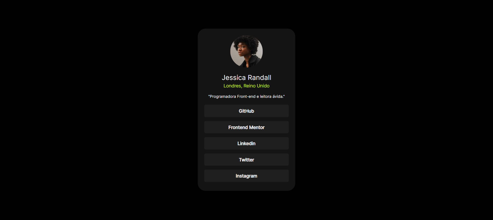

# Perfil de links Sociais

<div>

</div>

[Desafio do perfil de ligações sociais no Frontend Mentor](https://www.frontendmentor.io/challenges/social-links-profile-UG32l9m6dQ)

## Visão Geral

Projeto com intuito de promover contato com o desenvolvedor vem com botões de links de redes sociais e uma descrição bem curta sobre o profissional além de sua foto de perfil. Com uma interface interativa tem um design muito bacana, ele me lembra muito o linktree do Intagram, senão parecido.

## Desafios

Tive dois desafios nesse projeto, um deles foi posicionar a imagem, eu tentei fazer o circulo na imagem usando a propriedade border-radiuns somente no seletor da img, porém percebi que não tinha ficado tão legal. Pesquisei e procurei sobre como posionar melhor e encontrei isso e usarei daqui para frente.

````css
.circle{
    border-radius: 50%;
    width: 100px;
    height: 100px;
    overflow: hidden;
    position: relative;
    margin-bottom: 20px;
}
img{
    position: absolute;
    width: 100%;  
}
````

O outro desafio foi para retirar o espaço do último elemento da lista, tinha me esquecido completamente, eu ja estudei isso, porém acontece de esquecer...rsrsrsrsrs

````css
li{ 
    margin-bottom: 12px;
    list-style-type: none;
}
li:nth-child(5){
    margin-bottom: 0;
}
````

## Links
- [URL-da-solução](https://github.com/Denner-94/perfil-de-links-sociais)
- [URL-do-site-ativo](https://perfil-de-links-sociais-seven.vercel.app/)

## Construído com

- Marcação HTML5 semântica
- Propriedades personalizadas CSS
- Flexbox
- Fluxo de trabalho que prioriza os dispositivos móveis

## Aprendizagem

Com disse no topico de *desafios*. Relembrei coisas que tinha estudado para concluir algumas coisas.
Em algum projetos anteriores, encontrei dificuldades para o tamanho do card, pois testava no mobile, ele sempre ficava grande. Agora neste projeto não errei outra vez, eu aprendi!

## Desenvolvimento continuo

- Tenho aplicar a responsividade para telas maiores.

## Autor

- [Instagram](https://www.instagram.com/opretodenner/)
